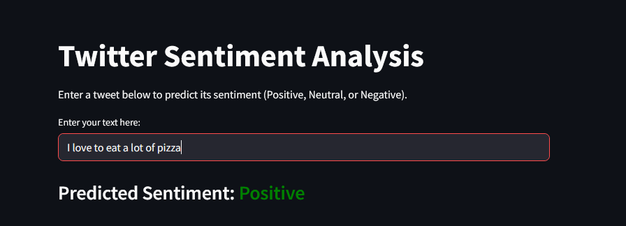
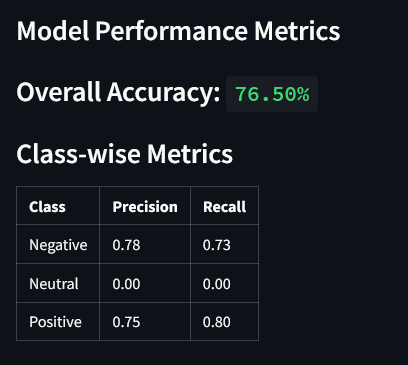

# Twitter Sentiment Analysis Application

## Author

Jesse Arevalo Baez <br>
2399233 <br>
arevalobaez@chapman.edu <br>
CPSC 370-06

This project is a real-time sentiment analysis tool for text data, built using Python, scikit-learn, and Streamlit. It leverages the Sentiment140 dataset to train a machine learning model that classifies input text as **Negative**, **Neutral**, or **Positive**.

## Live Demo

Try out the deployed web application here:  
[Twitter Sentiment Analysis App](https://cpsc-370-twitter-sentiment-analysis-7snkn9ohtyyehzwcyovbop.streamlit.app/)

Explore the real-time sentiment analysis tool, view model performance metrics, and test the app with your own text inputs.

## Features

- **Real-time Sentiment Prediction**: Enter any text and instantly see its predicted sentiment.
- **Pre-trained Model**: Uses a logistic regression model trained on the Sentiment140 dataset.
- **Web Interface**: Simple and interactive UI powered by Streamlit.
- **Model Performance Metrics**: The app dynamically displays the model's accuracy, precision, and recall for transparency.

## Project Structure

```
.
├── app.py                      # Streamlit web application
├── train_model.py              # Script to train and save the sentiment model
├── models/                     # Directory containing the saved model, vectorizer, and metrics
│   ├── sentiment_model.pkl     # Saved logistic regression model
│   ├── vectorizer.pkl          # Saved TfidfVectorizer
│   ├── metrics.json            # Model performance metrics (accuracy, precision, recall)
│   └── metadata.json           # Model metadata (training date, dataset size, etc.)
├── data/                       # Directory for datasets
│   ├── testdata.manual.2009.06.14.csv              # Manual test dataset
│   └── training.1600000.processed.noemoticon.csv   # Sentiment140 dataset (not included)
├── TestCases.txt               # Example test cases for model evaluation
├── images/                     # Screenshots and images for documentation
└── README.md                   # Project documentation
```

## Scripts Overview

### `train_model.py`

This script is responsible for training the sentiment analysis model. It performs the following tasks:

1. Loads and preprocesses the datasets:
   - **Manual Test Dataset**: `testdata.manual.2009.06.14.csv`
   - **Sentiment140 Dataset**: `training.1600000.processed.noemoticon.csv`
2. Cleans the text data by removing URLs, mentions, hashtags, and non-alphabetic characters.
3. Combines the datasets and vectorizes the text using `CountVectorizer`.
4. Splits the data into training and testing sets.
5. Trains a logistic regression model on the training data.
6. Evaluates the model on the test data and generates performance metrics (accuracy, precision, recall).
7. Saves the following to the `models/` directory:
   - `sentiment_model.pkl`: The trained logistic regression model.
   - `vectorizer.pkl`: The fitted `CountVectorizer`.
   - `metrics.json`: A JSON file containing the model's performance metrics.
   - `metadata.json`: A JSON file containing metadata about the trained model (e.g., training date, dataset size, vectorizer details).

### `app.py`

This script runs the Streamlit web application for real-time sentiment analysis. It performs the following tasks:

1. Loads the pre-trained model (`sentiment_model.pkl`) and vectorizer (`vectorizer.pkl`) from the `models/` directory.
2. Dynamically loads the model's performance metrics from `metrics.json`.
3. Dynamically loads model metadata from `metadata.json`.
4. Provides a user-friendly interface where users can input text to predict its sentiment.
5. Displays the predicted sentiment as **Negative**, **Neutral**, or **Positive** in real time.
6. Shows the model's performance metrics (accuracy, precision, recall) for transparency.

## Model Evaluation & Performance Metrics

- The logistic regression model is trained on the Sentiment140 dataset.
- After training, the model is evaluated on a held-out validation set (20% of the training data).
- The following metrics are calculated and saved to `metrics.json`:
  - **Accuracy**
  - **Precision** (for Negative, Neutral, and Positive classes)
  - **Recall** (for Negative, Neutral, and Positive classes)
- These metrics are dynamically loaded and displayed in the app.

## Snapshots

- Below are example screenshots of the running web application:

### Input and Prediction



### Model Metrics



## Setting Up the Project

Follow these steps to set up the project after pulling it from GitHub:

1. **Clone the Repository**  
   Clone the repository to your local machine using the following command:

   ```bash
   git clone https://github.com/arevalobaez18/CPSC-370-Twitter-Sentiment-Analysis.git
   cd CPSC-370-Twitter-Sentiment-Analysis
   ```

   Alternatively, you can also download a ZIP of it straight from github.

2. **Create a Virtual Environment**  
   It is recommended to use a virtual environment to manage dependencies:

   ```bash
   python -m venv venv
   source venv/bin/activate  # On macOS/Linux
   venv\Scripts\activate     # On Windows
   ```

3. **Install Dependencies**  
   Install the required Python packages listed in the `requirements.txt` file:

   ```bash
   pip install -r requirements.txt
   ```

4. **Run the Application**  
   Start the Streamlit application:

   ```bash
   streamlit run app.py
   ```

5. **Access the App**  
   Open your browser and navigate to the URL provided by Streamlit (usually `http://localhost:8501`).

6. **Optional: Train the Model**  
   If you want to retrain the model, run the `train_model.py` script:

   ```bash
   python train_model.py
   ```

   This will generate the model, vectorizer, and metrics files in the `models/` directory.
   **YOU MUST HAVE THE DATASETS WITHIN THE `/data` DIRECTORY FOR THE MODEL TO BE TRAINED**

## Test Cases

A set of test input examples is provided to help evaluate the model's sentiment predictions. These cases cover a variety of real-world and edge-case scenarios, including neutral statements that are often challenging for sentiment models. You can use these to manually or programmatically test the model's accuracy and its ability to distinguish between Negative, Neutral, and Positive sentiments.

**Example Test Cases:**

| Input Text                                                                                                                           | Expected Sentiment |
| ------------------------------------------------------------------------------------------------------------------------------------ | ------------------ |
| “Oh fantastic, another bug. Just what I needed.”                                                                                     | Negative           |
| “The design is beautiful, but the app crashes too much.”                                                                             | Negative           |
| “I don’t hate it.”                                                                                                                   | Positive           |
| “I used the app yesterday.”                                                                                                          | Neutral            |
| “Terrible.”                                                                                                                          | Negative           |
| “Amazing experience!”                                                                                                                | Positive           |
| “Gr8 job guys, luv this app!”                                                                                                        | Positive           |
| “Ths thing sux.”                                                                                                                     | Negative           |
| “Customer acquisition cost is too high for this to scale.”                                                                           | Negative           |
| “The campaign ROI exceeded expectations.”                                                                                            | Positive           |
| “Yeah, this app is so fast — it only froze five times today.”                                                                        | Negative           |
| “The customer service was slow, but the representative was kind.”                                                                    | Neutral            |
| “It’s not bad at all.”                                                                                                               | Positive           |
| “I wouldn’t say it’s great.”                                                                                                         | Neutral            |
| “meh.”                                                                                                                               | Negative           |
| “The user clicked the button three times.”                                                                                           | Neutral            |
| “The onboarding was clear, the UI was polished, and overall the app functioned well — though it could use a few speed improvements.” | Positive           |
| “This update is a huge improvement!”                                                                                                 | Positive           |
| “Could be worse, I guess.”                                                                                                           | Neutral            |
| “Worst. App. Ever.”                                                                                                                  | Negative           |

You can find these test cases in the `TestCases.txt` file. They are useful for validating the model's performance, especially for neutral sentiment detection.

## Limitations

While the model performs well on positive and negative sentiment detection, **neutral sentiment detection remains a challenge**. This is primarily due to the lack of neutral-labeled examples in the available datasets, such as Sentiment140, which contains very few tweets labeled as neutral. As a result, the model may misclassify neutral statements as either positive or negative, especially for subtle or ambiguous cases. Improving neutral sentiment detection would require a larger and more balanced dataset with a significant number of neutral examples.

## Acknowledgments

- [Streamlit](https://streamlit.io/): An open-source app framework for Machine Learning and Data Science projects, enabling the creation of interactive web applications with minimal effort.
- [scikit-learn](https://scikit-learn.org/): A powerful Python library for machine learning, providing tools for data preprocessing, model training, and evaluation.
- [Sentiment140 Dataset](https://www.kaggle.com/datasets/kazanova/sentiment140): A dataset containing 1.6 million tweets, labeled for sentiment analysis, used to train the model.
- [Vectorization in Machine Learning](https://www.comet.com/site/blog/vectorization-in-machine-learning/): A blog post explaining the importance of vectorization in machine learning.
- [CountVectorizer Documentation](https://scikit-learn.org/stable/modules/generated/sklearn.feature_extraction.text.CountVectorizer.html): Official scikit-learn documentation for `CountVectorizer`.
- [Linear Regression Using scikit-learn](https://www.geeksforgeeks.org/python-linear-regression-using-sklearn/): A tutorial on implementing linear regression using scikit-learn.
- [Saving Model Metadata](https://www.geeksforgeeks.org/saving-a-machine-learning-model/): A guide on saving and loading machine learning models in python.
